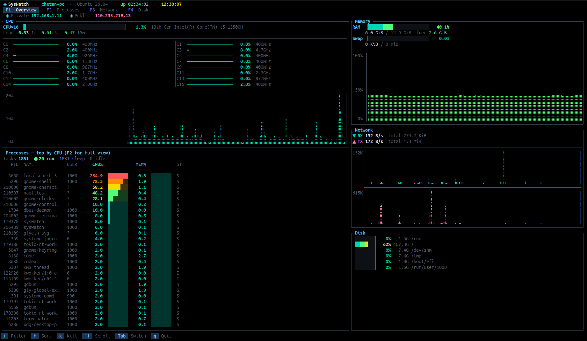

<div align="center">

<h1>◈ SysWatch</h1>

<p><strong>A high-performance, near-zero-footprint Linux and macOS system monitor — built in Rust.</strong></p>

<p>
  <a href="LICENSE"></a>
  <a href="https://www.rust-lang.org"></a>
  <a href="https://github.com/gurjarchetan/syswatch/releases"></a>
  <a href="https://github.com/gurjarchetan/syswatch/stargazers"></a>
  
</p>

<br>



<br>
<sub><i>Overview tab — CPU per-core bars with frequency, memory gauge, network sparklines, disk summary and process snapshot. All live.</i></sub>

</div>

---

---

## Table of Contents

- [Why SysWatch](#why-syswatch)
- [Features](#features)
- [Tabs Reference](#tabs-reference)
  - [F1 — Overview](#f1--overview)
  - [F2 — Processes](#f2--processes)
  - [F3 — Network](#f3--network)
  - [F4 — Disk](#f4--disk)
- [Installation](#installation)
  - [One-liner (Linux + macOS)](#option-0--one-liner-linux--macos)
  - [Pre-built .deb (Debian / Ubuntu)](#option-1--pre-built-deb-debian--ubuntu)
  - [Snap package](#option-2--snap-package)
  - [Pre-built .rpm (RHEL / Fedora / Amazon Linux)](#option-3--pre-built-rpm-rhel--fedora--amazon-linux)
  - [macOS Apple Silicon (M1/M2/M3/M4)](#option-4--macos-apple-silicon-m1m2m3m4)
  - [Install script (any Linux distro)](#option-5--install-script-any-linux-distro)
  - [Build from source](#option-6--build-from-source)
  - [Arch Linux (AUR)](#option-7--arch-linux-aur)
- [Usage](#usage)
- [Keyboard Shortcuts](#keyboard-shortcuts)
- [Architecture](#architecture)
- [Building packages locally](#building-packages-locally)
- [Uninstall](#uninstall)
- [License](#license)

---

## Why SysWatch

One command replaces all of these:

```bash
# Before — six separate commands scattered across your history:
htop                  # processes
free -h               # memory & swap
df -hT                # disk usage
uptime                # load average
iftop / nload         # live network traffic
ip addr               # private IP

# After — one command, everything live:
syswatch
```

| What you needed before | SysWatch tab |
|---|---|
| `htop` | **F2 Processes** — PID, CPU%, MEM%, Status, Threads, sort, kill |
| `free -h` | **F1 Overview → Memory** — RAM + Swap with progress bars |
| `df -hT` | **F4 Disk** — Filesystem, Type, Size, Used, Avail, Use%, IOPS |
| `uptime` | **Title bar** — `up 02:26:34` + load avg in CPU panel |
| `cat /etc/os-release` | **Title bar** — OS name + version, always visible |
| `iftop` / `nload` | **F3 Network** — per-interface RX/TX with sparkline graphs |
| `ip addr` | **F1 Overview** — Private IP at the top |
| `curl ifconfig.me` | **F1 Overview** — Public IP fetched once at startup |

---

## Features

| Area | Details |
|---|---|
| **CPU** | Global gauge + per-core utilisation bars with clock frequency; load average (1m / 5m / 15m); rolling Braille history graph colour-coded by usage level |
| **Memory** | Physical RAM — used / free; Swap — used / total; colour-coded progress bars; Braille history graph |
| **Network** | Per-interface RX / TX bandwidth; cumulative totals since launch; side-by-side Braille sparklines for download and upload history |
| **Disk** | Full `df -hT` style table — Filesystem, Type, Size, Used, Avail, Use% gradient bar, Mount point; real-time read/write throughput and IOPS sub-row per device |
| **Processes** | Searchable, sortable table — PID, Name, User, CPU%, MEM%, Status, Threads; inline mini-bars for CPU and MEM; detail popup (Enter); two-step SIGTERM / one-step SIGKILL |
| **IP info** | Private IP (primary interface via routing table) + Public IP (fetched via api.ipify.org once at startup) — always on the Overview page |
| **Performance** | ~2 Hz render cadence when idle; CPU freq read every ~5 s; process list refreshed every ~1 s; Braille graphs render as `O(1)` ring-buffer operations; near-zero CPU footprint |

---

## Tabs Reference

### F1 — Overview

The default landing page. Shows a high-density summary of every subsystem at a glance.

```
┌─ Layout ─────────────────────────────────────────────────────────────────┐
│  ◈ Private 192.168.1.11    ◈ Public 110.235.219.13                       │
│                                                                           │
│  ┌── CPU (60%) ──────────────────────────┐  ┌── Memory ────────────────┐ │
│  │  CPUx16 ▕████████████░░░░░░░░░░░░▏   │  │  RAM  38.2%              │ │
│  │  Load   0.09 1m  0.14 5m  0.26 15m   │  │  5.7G / 14.9G  free 3.2G│ │
│  │  C0  55.1% ··  C1  22.4% ··  ...     │  │  Swap  0.0%  0 KiB       │ │
│  │  ▁▁▂▃▄▅▆▇█ history graph ▇▆▅         │  │  ▁▁▂▁▂▃▂▁▁ history       │ │
│  ├── Processes (top by CPU) ────────────┤  ├── Network ───────────────┤ │
│  │  5290 gnome-shell  97.0%  1.7%  S    │  │  ▼ RX  0 B/s  72.6 KiB  │ │
│  │  ...  (click F2 for full view)       │  │  ▲ TX  5.1 KB/s 132 KiB  │ │
│  └───────────────────────────────────── ┘  ├── Disk ────────────────── ┤ │
│                                            │  62% 467G /               │ │
│                                            │   0% 1.5G /run            │ │
│                                            └──────────────────────────── ┘ │
└───────────────────────────────────────────────────────────────────────────┘
```

- **Left column (60%)** — CPU widget on top, live process snapshot below (top consumers, sorted by CPU%)
- **Right column (40%)** — Memory, Network summary, Disk summary stacked vertically
- Private and Public IPs pinned to the top bar — always visible without switching tabs

---

### F2 — Processes

Full interactive process manager. Scrollable, filterable, sortable.

```
┌ Processes (312) ──────────────────────────────────────────────────────────┐
│ Tasks 1767   ● 18 run   1749 sleep   0 idle                               │
│ Sort: [CPU▼] [MEM] [PID] [NAME]    /=filter  k=kill  K=SIGKILL  Esc=cancel│
│    PID  NAME                USER       CPU%  ██████  MEM%  ██████  ST THR │
│ ─────────────────────────────────────────────────────────────────────────  │
│   5290  gnome-shell          1000      97.0  ██████   1.7  ░░░░░░  S   1  │
│ 179378  syswatch             1000       8.1  █░░░░░   0.1  ░░░░░░  S   3  │
│  11295  terminator           1000       8.1  █░░░░░   0.7  ░░░░░░  S   3  │
└───────────────────────────────────────────────────────────────────────────┘
```

**Interactions:**

| Action | Key |
|---|---|
| Scroll rows | `↑` `↓` or `j` `k` |
| Filter by name | `/` then type — live filter; `Esc` to clear |
| Cycle sort column | `f` — CPU% → MEM% → PID → Name |
| Arm kill (SIGTERM) | `k` — row turns red; `k` again to confirm |
| Instant SIGKILL | `K` (uppercase) |
| Process detail popup | `Enter` — shows CPU bar, MEM bar, status, threads |
| Close popup | `Enter` or `Esc` |

---

### F3 — Network

Real-time bandwidth monitoring with per-interface breakdown and historical sparklines.

```
┌ Network ──────────────────────────────────────────────────────────────────┐
│ ▼ RX  4.7 KB/s   total  71.3 KiB       ▲ TX  1.2 KB/s   total 118.6 KiB │
│ ─────────────────────────────────────────────────────────────────────────  │
│   Interface          ▼ RX/s        ▲ TX/s                                 │
│   wlp2s0         4.7 KB/s      1.2 KB/s                                  │
│   lo              0.0 B/s      0.0 B/s                                    │
│ ─────────────────────────────────────────────────────────────────────────  │
│  RX │⣿⣿⣷⣦⣄⣀⣠⣴⣾⣿⣿⣿⣿⣿  │  TX │⣿⣷⣶⣴⣤⣠⣀⣄⣤⣶⣾⣿⣿⣿⣿  │
│  50%│                    │  50%│                    │
│   0%│                    │   0%│                    │
└───────────────────────────────────────────────────────────────────────────┘
```

- Braille sparkline graphs for download and upload rendered side-by-side
- Y-axis labels: `max`, `50%`, `0%` — scale is relative to peak since startup
- All values are bytes-per-second; totals are cumulative since syswatch launched

---

### F4 — Disk

`df -hT` equivalent with real-time I/O throughput. Scrollable with `↑` `↓`.

```
┌ Disk ─────────────────────────────────────────────────────────────────────┐
│ Filesystem           Type      Size    Used   Avail                 Use%  │
│ /dev/nvme0n1p2       ext4      467G    292G    151G  ▕██████████░░▏  62%  │
│   r: 0 B/s   w: 1.2 M/s   riops: 0   wiops: 12                           │
│ /dev/nvme0n1p1       vfat      1.5G    6.4M    1.5G  ▕░░░░░░░░░░░░▏   0%  │
│ /dev/shm             tmpfs     7.4G    2.3G    5.1G  ▕██░░░░░░░░░░▏  31%  │
│ /tmp                 tmpfs     7.4G      0G    7.4G  ▕░░░░░░░░░░░░▏   0%  │
│ /boot/efi            vfat      1.0G    6.4M    1.0G  ▕░░░░░░░░░░░░▏   1%  │
└───────────────────────────────────────────────────────────────────────────┘
```

- Mount points discovered automatically via `/proc/mounts`
- Virtual/kernel filesystems (`proc`, `sysfs`, `cgroup`, `squashfs`, …) filtered out automatically
- I/O sub-row (`r:` / `w:` / `riops:` / `wiops:`) only appears when a device has active throughput
- Gradient colour bar: teal (low) → green → yellow → orange → red (≥ 90%)
- Use `↑` `↓` to scroll when there are more filesystems than fit on screen

---

## Installation

### Option 0 — One-liner (Linux + macOS)

Works on all distributions and macOS. Detects your OS and architecture automatically. No root required.

```bash
curl -fsSL https://raw.githubusercontent.com/gurjarchetan/syswatch/main/install.sh | bash
```

Downloads the correct binary for your platform, places it in `~/.local/bin`, and adds it to your `$PATH`.

---

### Option 1 — Pre-built `.deb` (Debian / Ubuntu)

```bash
wget https://github.com/gurjarchetan/syswatch/releases/latest/download/syswatch_0.7.0_amd64.deb
sudo dpkg -i syswatch_0.7.0_amd64.deb
syswatch
```

### Option 2 — Snap package

```bash
sudo snap install syswatch
```

### Option 3 — Pre-built `.rpm` (RHEL / Fedora / Amazon Linux)

```bash
wget https://github.com/gurjarchetan/syswatch/releases/latest/download/syswatch-0.7.0-1.x86_64.rpm

# Fedora / RHEL 8+ / Amazon Linux 2023
sudo dnf install ./syswatch-0.7.0-1.x86_64.rpm

# CentOS 7 / Amazon Linux 2
sudo yum install ./syswatch-0.7.0-1.x86_64.rpm

# Raw rpm
sudo rpm -i syswatch-0.7.0-1.x86_64.rpm
```

### Option 4 — macOS Apple Silicon (M1/M2/M3/M4)

> Pre-built binaries are available for **Apple Silicon only**. Intel Macs must build from source (see Option 6).

```bash
curl -LO https://github.com/gurjarchetan/syswatch/releases/latest/download/syswatch-0.7.0-macos-aarch64.tar.gz
tar -xzf syswatch-0.7.0-macos-aarch64.tar.gz
sudo mv syswatch /usr/local/bin/
syswatch
```

> **First run on macOS:** Gatekeeper may block the binary. Run once to clear the quarantine flag:
> ```bash
> xattr -d com.apple.quarantine /usr/local/bin/syswatch
> ```

### Option 5 — Install script (any Linux distro)

Works on all distributions — Debian, Ubuntu, RHEL, CentOS, Amazon Linux, Fedora, Arch, Alpine, openSUSE, and more. No root required.

```bash
curl -fsSL https://raw.githubusercontent.com/gurjarchetan/syswatch/main/install.sh | bash
```

Downloads the correct binary for your architecture, places it in `~/.local/bin`, and adds it to your `$PATH`.

### Option 6 — Build from source

**Requires:** Rust 1.75+ — install via [rustup](https://rustup.rs)

```bash
git clone https://github.com/gurjarchetan/syswatch.git
cd syswatch

# Run directly
cargo run --release

# Or install to ~/.cargo/bin/ and run from anywhere
cargo install --path .
syswatch
```

### Option 7 — Arch Linux (AUR)

```bash
yay -S syswatch-bin
# or
paru -S syswatch-bin
```

---

## Usage

```
USAGE:
    syswatch [OPTIONS]

OPTIONS:
    -h, --help              Show this help message and exit
    -V, --version           Show version and exit
    -t, --tab <TAB>         Start on a specific tab
                              overview   (default)
                              processes
                              network
                              disk
    -i, --interval <MS>     Data-collection interval in milliseconds
                            (default: 500, min: 100)
```

**Examples**

```bash
syswatch                          # Overview tab, 500ms refresh
syswatch --tab processes          # Jump straight to process manager
syswatch --tab disk               # Jump straight to disk view
syswatch --interval 250           # Refresh twice as fast (250 ms)
syswatch -t network -i 1000       # Network tab, 1 second interval
```

---

## Keyboard Shortcuts

| Key | Action |
|---|---|
| `F1` | Overview tab |
| `F2` | Processes tab |
| `F3` | Network tab |
| `F4` | Disk tab |
| `Tab` | Cycle through tabs |
| `↑` `↓` | Scroll rows / select process |
| `j` `k` | Scroll down / up (vim-style) |
| `/` | Filter mode — type to search processes by name |
| `Esc` | Exit filter mode, cancel kill confirmation, close popup |
| `Enter` | Open process detail popup (F2 tab) |
| `f` | Cycle sort: CPU% → MEM% → PID → Name |
| `k` | Arm kill — selected row turns red; press `k` again → SIGTERM |
| `K` | Send SIGKILL immediately to selected process |
| `q` | Quit |
| `Ctrl-C` | Force quit |

> Mouse scroll wheel is supported on the process list and disk view.

---

## Architecture

```
syswatch/
├── src/
│   ├── main.rs              ← Entry point: CLI parsing, terminal setup, render loop
│   ├── app.rs               ← UI state: active tab, sort col, filter, scroll, proc cache
│   │
│   ├── collector/           ── DATA LAYER (async tokio task, runs every interval_ms) ──
│   │   ├── mod.rs           ← SharedState (Arc<RwLock<SystemState>>), spawn_collector()
│   │   ├── cpu.rs           ← Per-core usage, frequency, global avg, load average
│   │   ├── memory.rs        ← RAM and Swap via sysinfo
│   │   ├── disk.rs          ← /proc/mounts + statvfs + /proc/diskstats delta I/O
│   │   ├── network.rs       ← Per-interface RX/TX bytes/sec, cumulative totals
│   │   └── process.rs       ← Process list with CPU%, MEM%, status, threads
│   │
│   ├── input/
│   │   └── mod.rs           ← Keyboard + mouse event handler (crossterm)
│   │
│   └── ui/                  ── RENDER LAYER (ratatui, runs at ≤ 2 fps when idle) ──
│       ├── mod.rs           ← draw() dispatcher — routes to active tab renderer
│       ├── braille.rs       ← Braille sparkline engine (Unicode U+2800 block)
│       ├── theme.rs         ← Colour palette and gradient helpers
│       ├── widgets/
│       │   ├── cpu_widget.rs  ← Per-core bars + global gauge + history graph
│       │   ├── mem_widget.rs  ← RAM/Swap progress bars + history graph
│       │   ├── gauge.rs       ← Reusable gradient bar primitive
│       │   ├── title_bar.rs   ← Hostname, OS, uptime, clock
│       │   ├── tab_bar.rs     ← F1–F4 tab strip
│       │   └── status_bar.rs  ← Bottom hint bar
│       └── layout/
│           ├── overview.rs    ← F1: 60/40 split, IP bar, proc snapshot
│           ├── processes.rs   ← F2: sortable table + detail popup
│           ├── network.rs     ← F3: interface table + side-by-side sparklines
│           └── disk.rs        ← F4: df-style table + I/O sub-rows
└── packaging/
    ├── syswatch.1             ← man page
    ├── syswatch.desktop       ← .desktop entry
    └── snapcraft.yaml         ← Snap build config
```

### Design decisions

| Principle | How it's implemented |
|---|---|
| **Near-zero CPU overhead** | Render loop blocks on `event::poll` until next scheduled redraw (~500 ms) instead of spinning at 20 Hz. CPU frequency reads are throttled to every ~5 s. Process list refreshes every ~1 s. Disk I/O refreshes every ~3 s. |
| **No startup delay** | `System::new_all()` (blocking `/proc` scan) runs on a `spawn_blocking` thread so it never starves the async render thread. First data collection fires at `tick = 0` so all panels populate immediately on launch. |
| **Minimal allocations** | Collector-local `VecDeque` ring buffers (capacity pre-allocated at `HISTORY_LEN = 512`). History is written to `SharedState` via `mem::take` + `extend_from_slice` — no `Vec` ever reallocates after the first tick. Process status labels are `&'static str`, not `String`. |
| **Short critical section** | The `RwLock` write guard is held only for assignment — all computation (braille rendering, sorting, formatting) happens outside the lock. UI renderers clone a snapshot first, then release the lock before any layout work. |
| **Strict layer separation** | The collector and the UI share state exclusively through `Arc<RwLock<SystemState>>`. Neither layer knows about the other's internals. |

---

## Building packages locally

**Debian / Ubuntu `.deb`**

```bash
cargo install cargo-deb
cargo deb
# → target/debian/syswatch_0.7.0_amd64.deb
```

**RHEL / Fedora / Amazon Linux `.rpm`**

```bash
cargo install cargo-generate-rpm
cargo build --release
cargo generate-rpm
# → target/generate-rpm/syswatch-0.7.0-1.x86_64.rpm
```

---

## Uninstall

```bash
# Installed via .deb
sudo dpkg -r syswatch

# Installed via snap
sudo snap remove syswatch

# Installed via install.sh
rm ~/.local/bin/syswatch

# Installed via cargo
cargo uninstall syswatch
```

---

## License

MIT — see [LICENSE](LICENSE)

---

<div align="center">
<sub>Made with ♥ in Rust · <a href="https://github.com/gurjarchetan/syswatch">github.com/gurjarchetan/syswatch</a></sub>
</div>


```bash
# Before — you needed all of these:
htop                  # CPU & processes
free -h               # memory & swap
df -hT                # disk usage per mount point
uptime                # load average & system uptime
cat /etc/os-release   # OS & kernel version
iftop / nload         # live network traffic
ip addr               # private IP address
curl ifconfig.me      # public IP address

# With SysWatch — one command shows everything, live:
syswatch
```

| Old command | SysWatch equivalent |
|---|---|
| `htop` | F2 Processes — PID, CPU%, MEM%, sort, kill |
| `free -h` | F1 Overview → Memory panel — RAM + Swap bars |
| `df -hT` | F4 Disk — filesystem, type, size, used, avail, IOPS |
| `uptime` | Title bar — `up 02:14:07` + load avg in CPU panel |
| `cat /etc/os-release` | Title bar — OS name + version |
| `iftop` / `nload` | F3 Network — per-interface RX/TX + sparklines |
| `ip addr` | F1 Overview → Private IP bar (top) |
| `curl ifconfig.me` | F1 Overview → Public IP bar (top) |

---

```
 ◈ SysWatch | chetan-pc | Ubuntu 26.04  up 02:14:07 | 14:32:01
 F1 Overview   F2 Processes   F3 Network   F4 Disk

  ⬡ Private IP: 192.168.1.100   ⬡ Public IP:  203.0.113.42

┌ CPU ──────────────────────────────────────────────────────────────┐┌ Memory ─────────────────────────────┐
│CPU×16 ▕████████████░░░░░░░░░░░░░░░░░░▏  41.2%  13th Gen i5-13500H││RAM  [█████████████░░░░░░░]  66.5%    │
│Load avg 0.42 1m  0.51 5m  0.38 15m                                ││     9.9 GiB / 14.9 GiB (Free: 1.3G) │
│────────────────────────────────────────────────────────────────── ││Swap [░░░░░░░░░░░░░░░░░░░░]   0.0%    │
│C0  ▕████████░░░░▏  55.1%  2.4GHz │C1  ▕█████████░░░░▏  62.3%  2.4GHz│└─────────────────────────────────────┘
│C2  ▕███████░░░░░▏  48.0%  2.1GHz │C3  ▕██████░░░░░░▏   41.2%  1.9GHz│┌ Network ────────────────────────────┐
│────────────────────────────────────────────────────────────────── ││▲ TX  1.2 KB/s  Total: 118.6 KiB     │
│100%│                                                 ▄▅▆▇         ││▼ RX  4.7 KB/s  Total:  71.3 KiB     │
│ 50%│                                   ▂▃  ▂▁▃▄▅▅▆▇████         │└─────────────────────────────────────┘
│  0%│▁▁▁▁▁▁▁▁▁▁▁▁▁▂▁▂▁▂▃▃▃▄▃▃▄▄▄▄▅▅▅▅▅▆████████████████         │┌ Disk ───────────────────────────────┐
└───────────────────────────────────────────────────────────────────┘│[██████░░░░]  62%  468.0G  /          │
                                                                      │[░░░░░░░░░░]   1%   1.1G  /boot/efi  │
                                                                      └─────────────────────────────────────┘
 [q] Quit  [Tab] Switch tab  [↑↓] Scroll  [F4] Full disk details
```

---

## Features

| Panel | What you get |
|---|---|
| **CPU** | Per-core bars with clock frequency (`2.4GHz` · `800MHz`), global gauge, load average (1m/5m/15m), rolling history graph |
| **Memory** | Physical RAM — used / cached / free breakdown + Swap, colour-coded progress bars |
| **Disk** | `df -hT` style table — Filesystem, Type, Size, Used, Avail, Use% bar, Mounted on; real-time IOPS + throughput per mount point |
| **Network** | Per-interface RX/TX bandwidth, cumulative totals since launch, sparklines |
| **Processes** | Searchable, sortable table — PID, Name, User, CPU%, MEM%, Threads, Status (Running/Sleeping/Zombie/…) |
| **IP Info** | Private IP (primary interface) + Public IP (fetched once at startup) displayed on the Overview page |

**Disk tab — mount-point overview**

```
 ◈ SysWatch | F1 Overview   F2 Processes   F3 Network  [F4 Disk]

┌ Disk ──────────────────────────────────────────────────────────────────────────────────┐
│Filesystem             Type       Size   Used  Avail                    Use% Mounted on │
│/dev/nvme0n1p2         ext4       468G   292G   152G  [████████░░░░]     62%  /         │
│  r:0B/s     w:1.2M/s   riops:0   wiops:12                                              │
│/dev/nvme0n1p1         vfat       1.1G   6.4M   1.1G  [░░░░░░░░░░░░]      1%  /boot/efi│
│tmpfs                  tmpfs       16G   2.3G    14G  [██░░░░░░░░░░]     14%  /dev/shm  │
│tmpfs                  tmpfs      1.5G   2.9M   1.5G  [░░░░░░░░░░░░]      1%  /run      │
│tmpfs                  tmpfs      7.5G   9.1M   7.5G  [░░░░░░░░░░░░]      1%  /tmp      │
└────────────────────────────────────────────────────────────────────────────────────────┘
 [q] Quit  [Tab] Switch tab  [↑↓] Scroll
```

Mount points are discovered automatically via `/proc/mounts`. The I/O sub-row (`r:` / `w:` / `riops:` / `wiops:`) only appears when a device has active throughput.

---

**Processes tab (F2)**

```
 ◈ SysWatch | F1 Overview  [F2 Processes]  F3 Network   F4 Disk

┌ Processes (312) ──────────────────────────────────────────────────────────────────────┐
│Tasks: 312  ●  Run:3  Sleep:289  Idle:18  Stop:0  Zombie:0                             │
│Sort: [CPU▼] [MEM] [PID] [NAME]  f=cycle  /=filter  k=kill(arm)  K=SIGKILL  Esc=cancel│
│    PID  NAME                  USER        CPU%     MEM%  ST   THR STATUS              │
│──────────────────────────────────────────────────────────────────────────────────────  │
│ 246131  code                  chetan       14.30     2.10  S     35 Sleeping           │
│ 246089  chrome                chetan        8.12     3.45  S     42 Sleeping           │
│   1823  Xorg                  root          3.90     0.88  S     11 Sleeping           │
│ 246401  syswatch              chetan        2.10     0.12  R      4 Running            │
│   9871  pulseaudio            chetan        0.80     0.20  S      5 Sleeping           │
│    912  systemd-journald      root          0.30     0.15  S      1 Sleeping           │
└───────────────────────────────────────────────────────────────────────────────────────┘
```

> Type `/` to filter by name in real time · `f` cycles sort: CPU→MEM→PID→Name · `k` to arm kill

---

**Network tab (F3)**

```
 ◈ SysWatch | F1 Overview   F2 Processes  [F3 Network]  F4 Disk

┌ Network Deep Dive ────────────────────────────────────────────────────────────────────┐
│▼ Download   4.7 KB/s  Total:  71.3 KiB                                                │
│▲ Upload     1.2 KB/s  Total: 118.6 KiB                                                │
│                                                                                        │
│RX History                              TX History                                      │
│▁▁▂▁▂▃▄▅▆▇█▇▆▅▄▃▂▃▄▅▆▇██               ▁▁▁▁▂▃▂▁▁▂▃▄▃▂▃▄▅▄▃▂▁▁▁▁▁                    │
│                                                                                        │
│  wlp2s0      RX      4.7 KB/s  TX      1.2 KB/s                                       │
│  lo          RX      0.0 B/s   TX      0.0 B/s                                        │
└───────────────────────────────────────────────────────────────────────────────────────┘
```

---

**Visual highlights**
- Block-character history graph (`▁▂▃▄▅▆▇█`) with Y-axis labels — instantly readable CPU trend
- Gradient colour per bar: cyan (idle) → green → yellow → red (hot)
- Load average colour-coded vs core count — turns red when system is overloaded
- Process state summary bar: **Run / Sleep / Idle / Stop / Zombie** counts at a glance
- Two-step kill: `k` arms (row highlights red) → `k` sends SIGTERM · `K` sends SIGKILL
- **Private + Public IP** shown at a glance on the Overview page — no more `ip addr` / `curl ifconfig.me`
- Mouse scroll support
- Responsive layout — adapts to any terminal width/height

---

## Installation

### Option 1 — Pre-built `.deb` (Debian / Ubuntu)

```bash
# Download the latest release
wget https://github.com/gurjarchetan/syswatch/releases/latest/download/syswatch_0.7.0_amd64.deb

# Install
sudo dpkg -i syswatch_0.7.0_amd64.deb

# Run
syswatch
```

### Option 2 — Snap package

```bash
sudo snap install syswatch
```

### Option 3 — Pre-built `.rpm` (RHEL / CentOS / Amazon Linux / Fedora)

```bash
# Download the latest release
wget https://github.com/gurjarchetan/syswatch/releases/latest/download/syswatch-0.7.0-1.x86_64.rpm

# Install (Amazon Linux / RHEL / CentOS / Fedora)
sudo rpm -i syswatch-0.7.0-1.x86_64.rpm
# or with dnf (Fedora / RHEL 8+ / Amazon Linux 2023)
sudo dnf install ./syswatch-0.7.0-1.x86_64.rpm
# or with yum (CentOS 7 / Amazon Linux 2)
sudo yum install ./syswatch-0.7.0-1.x86_64.rpm

# Run
syswatch
```

### Option 4 — Install script (Linux + macOS)

Works on **all** distributions and macOS — Debian, Ubuntu, RHEL, CentOS, Amazon Linux, Fedora, Arch, Alpine, openSUSE, macOS (Intel + Apple Silicon), and more. No root required.

```bash
curl -fsSL https://raw.githubusercontent.com/gurjarchetan/syswatch/main/install.sh | bash
```

This downloads the correct binary for your platform and architecture, places it in `~/.local/bin`, and adds it to your `$PATH`.

### Option 5 — Build from source

**Prerequisites:** Rust 1.75+ ([install via rustup](https://rustup.rs))

```bash
# Clone
git clone https://github.com/gurjarchetan/syswatch.git
cd syswatch

# Run directly
cargo run --release

# Or install to ~/.cargo/bin/
cargo install --path .

# Then run from anywhere
syswatch
```

### Option 6 — Arch Linux (AUR)

```bash
yay -S syswatch-bin
# or
paru -S syswatch-bin
```

---

## CLI Usage

```
USAGE:
    syswatch [OPTIONS]

OPTIONS:
    -h, --help              Show this help message and exit
    -V, --version           Show version and exit
    -t, --tab <TAB>         Start on a specific tab
                              overview   (default)
                              processes
                              network
                              disk
    -i, --interval <MS>     Data-collection interval in ms (default: 500, min: 100)
```

**Examples**

```bash
syswatch                         # Start on Overview tab
syswatch --tab processes         # Jump straight to Processes
syswatch --tab disk              # Jump straight to Disk
syswatch --interval 250          # Refresh every 250 ms
syswatch -t network -i 1000      # Network tab, 1 s interval
```

---

## Keyboard Shortcuts

| Key | Action |
|---|---|
| `F1` / `F2` / `F3` / `F4` | Switch to Overview / Processes / Network / Disk tab |
| `Tab` | Cycle through tabs |
| `↑` `↓` | Scroll / select process |
| `j` | Scroll down (vim-style) |
| `/` | Enter filter mode — type to search processes by name |
| `Esc` / `Enter` | Exit filter or cancel kill confirmation |
| `f` | Cycle sort column: CPU% → MEM% → PID → Name |
| `k` | **Arm** kill — row turns red; press `k` again to send `SIGTERM` |
| `K` | Send `SIGKILL` immediately to selected process |
| `q` | Quit |
| `Ctrl-C` | Force quit |

> Mouse scroll is supported on the process list in all terminals with mouse reporting.

---

## Uninstall

```bash
# If installed via .deb
sudo dpkg -r syswatch

# If installed via snap
sudo snap remove syswatch

# If installed via cargo
cargo uninstall syswatch

# If installed via install.sh
rm ~/.local/bin/syswatch
```

---

## Architecture

```
src/
├── main.rs                  ← tokio entry point, terminal setup, render loop
├── app.rs                   ← shared UI state (tab, sort, filter, scroll)
├── collector/               ← DATA LAYER — runs every 500 ms
│   ├── mod.rs               ← Arc<RwLock<SystemState>>, spawn_collector()
│   ├── cpu.rs               ← per-core %, global usage, 60-sample history
│   ├── memory.rs            ← RAM / Swap via sysinfo
│   ├── disk.rs              ← mount points, space, I/O
│   ├── network.rs           ← per-interface RX/TX, cumulative totals
│   └── process.rs           ← process list, sort by CPU
└── ui/                      ← RENDER LAYER — runs at ≤ 30 fps
    ├── mod.rs               ← top-level draw() dispatcher
    ├── braille.rs           ← Braille sparkline engine (U+2800 block)
    ├── theme.rs             ← colour-coded status styles
    ├── widgets/             ← reusable components
    │   ├── cpu_widget.rs
    │   ├── mem_widget.rs
    │   ├── gauge.rs
    │   ├── title_bar.rs
    │   ├── tab_bar.rs
    │   └── status_bar.rs
    └── layout/              ← per-tab responsive grid layouts
        ├── overview.rs
        ├── processes.rs
        ├── network.rs
        └── disk.rs
input/
└── mod.rs                   ← async crossterm keyboard + mouse event loop
```

### Design principles

| Principle | Implementation |
|---|---|
| **Near-zero CPU overhead** | 500 ms data sampling · ≤ 30 fps render · non-blocking 50 ms event poll |
| **Strict layer separation** | `collector` and `ui` share state only via `Arc<RwLock<SystemState>>` |
| **No blocking** | All I/O and event polling is async via `tokio` |
| **Memory safe** | Written in Rust — no GC pauses, no segfaults |

---

## Building packages locally

**Debian / Ubuntu (`.deb`)**
```bash
cargo install cargo-deb
cargo deb
# Output: target/debian/syswatch_0.7.0_amd64.deb
```

**RHEL / CentOS / Amazon Linux / Fedora (`.rpm`)**
```bash
cargo install cargo-generate-rpm
cargo build --release
cargo generate-rpm
# Output: target/generate-rpm/syswatch-0.7.0-1.x86_64.rpm
```

---

## License

MIT — see [LICENSE](LICENSE)
